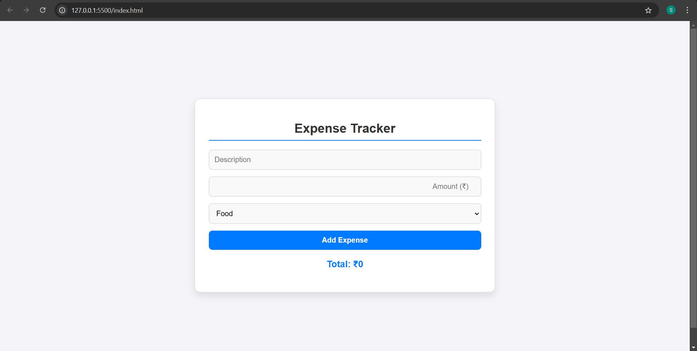
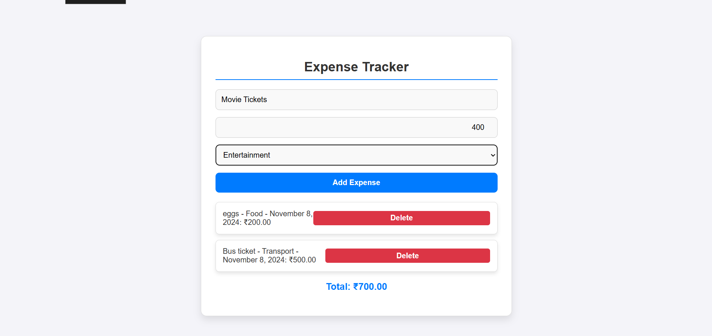

# Expense Tracker

A simple, responsive **Expense Tracker** website built with **HTML**, **CSS**, and **JavaScript**. This website helps users track their daily expenses by allowing them to input expense details (amount, date, category) and view a summary of their spending.

## Features

- Add new expenses by entering the amount, date, and category.
- View a list of all expenses in a tabular format.
- Edit or delete individual expenses.

## Tech Stack
- **Frontend**: HTML, CSS, JavaScript

## Usage
- Open the website in a browser by opening index.html.
- Add a new expense using the provided form (Amount, Date, Category).
- View and manage the list of expenses.

## Screenshots

Here are some screenshots of the Expense Tracker in action:

1. **Homepage**

2. **Expense List**

